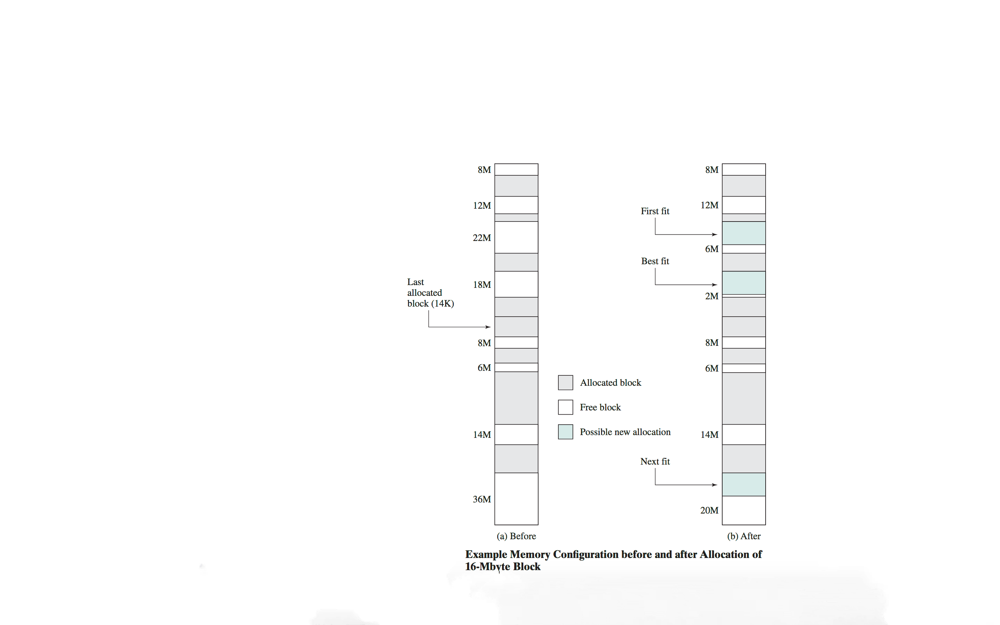

# 11.5 Memory allocation strategies

**The simulation mimics a series of request and release operations:**

* Physical memory is implemented as an integer array of size n.

* Each allocated block starts with a positive integer, which indicates the length of the block.

* Each hole starts with a negative integer, -k, where the absolute value k indicates the length of the hole.

* The following figure shows an example of memory configurations before and after a number of placement and swapping-out operations.

* An application sends a 16- Mbyte allocation request to memory management. Figure (b) shows the memory configuration after the memory allocations based on the different allocation strategies.

* Memory utilization is the ratio of space occupied by blocks divided by the total memory size n, and can vary from 0 to 1.



```c
repeat x times                        /* x is the number of simulation steps  */
   repeat until request fails         /* satisfy the next 0 or more requests */
      choose random number s          /* s is the request size chosen from a normal distribution */
      request(s)                      /* attempt to satisfy the request using chosen method;
                                         count number of holes examined and average the count
                                         over the number of request operations */
   record current memory utilization  /* size of occupied space divided by n */
   select an occupied block i         /* block to be released is selected at random */
   release(i)                         /* release selected block */
compute average memory utilization
compute average number of holes examined
```

* Implement the above simulation for two or more of the allocation strategies first-fit, next-fit, best-fit, worst-fit.

* Run the simulation using different allocation strategies and record the average memory utilizations and the average search times (numbers of holes examined to satisfy the request).

* Compute the memory utilizations for different strategies and compare the performance of the memory allocation strategies first-fir, next-fit, best-fit, and next-fit.
